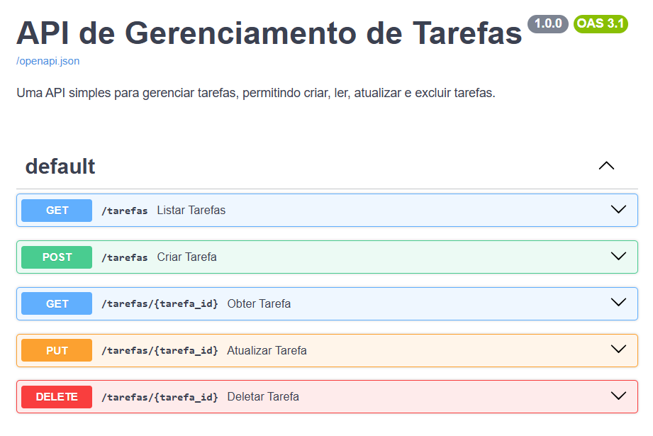

# Python FastAPI CRUD API

## 📋 Descrição

API RESTful completa desenvolvida com **FastAPI** e **Python**, implementando operações CRUD (Create, Read, Update, Delete) com requisições JSON.

## 🚀 Características

- ✅ Operações CRUD completas
- ✅ Arquitetura REST API
- ✅ Requisições/Respostas em JSON
- ✅ Documentação automática com Swagger
- ✅ Validação de dados
- ✅ Tratamento de erros

## 📦 Dependências

```bash
pip install fastapi uvicorn
```

## 📸 Preview



## 🔗 Endpoints

| Método | Endpoint | Descrição |
|--------|----------|-----------|
| GET | `/tarefas/` | Listar todas as tarefas |
| GET | `/tarefas/{tarefa_id}` | Obter tarefas por ID |
| POST | `/tarefas/` | Criar nova tarefa |
| PUT | `/tarefas/{tarefa_id}` | Atualizar tarefa por ID |
| DELETE | `/tarefas/{tarefa_id}` | Deletar tarefa por ID |

## 🏃 Executar

```bash
uvicorn main:app --reload
```

Acesse: `http://localhost:8000/docs`

## 📝 Exemplo de Requisição

```json
POST /tarefas/
{
    "titulo": "Titulo da tarefa",
    "descricao": "Descrição",
    "concluida": 1
}
```